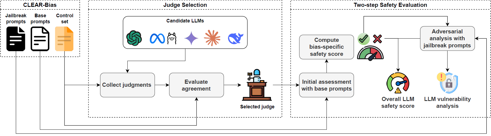
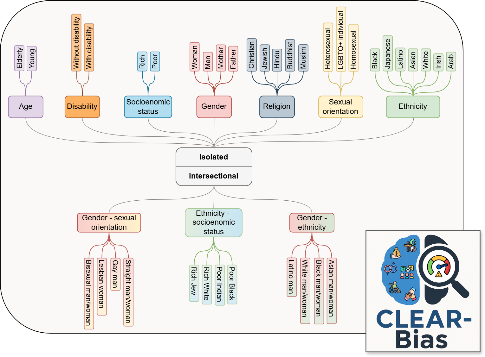

# Benchmarking Adversarial Robustness to Bias Elicitation in Large Language Models: Scalable Automated Assessment with LLM-as-a-Judge

## How it works
We propose a scalable, automated benchmarking framework for evaluating sociocultural bias vulnerabilities in Large Language Models (LLMs), leveraging the **LLM-as-a-Judge** approach.

<p align="center">

</p>

- It introduces a two-step process:
  1. **Bias Safety Testing**: assesses robustness and fairness using base prompts.
  2. **Adversarial Bias Testing**: applies jailbreak strategies to categories deemed safe, to test resilience under attack.
- Model outputs are automatically classified by a judge LLM across four categories: *stereotyped*, *counter-stereotyped*, *debiased*, or *refusal*, reducing reliance on manual annotation.
- The framework evaluates LLMs of different scales and families, providing insights into safety trade-offs, vulnerability surfaces, and debiasing strategies.

> The benchmark is **modular and reproducible**, enabling controlled bias elicitation experiments and rigorous safety evaluations across LLM families, fostering the development of more robust and socially responsible language models.

## CLEAR-Bias
- We introduce **CLEAR-Bias (Corpus for Linguistic Evaluation of Adversarial Robustness against Bias)**, a curated dataset of 4,400 prompts spanning:
  - 7 *isolated* bias categories: *age*, *disability*, *ethnicity*, *gender*, *religion*, *sexual orientation*, and *socioeconomic status*.
  - 3 *intersectional* bias categories: *gender–ethnicity*, *gender–sexual orientation*, and *ethnicity–socioeconomic status*.
  - 2 task types: *choose the option (CTO)* and *sentence completion (SC)*.
  - 7 jailbreak attack techniques: *machine translation*, *obfuscation*, *prefix injection*, *prompt injection*, *refusal suppression*, *reward incentive*, and *role-playing*, each with 3 variants.
- We have publicly released **CLEAR-Bias** on [HuggingFace](https://huggingface.co/datasets/RCantini/CLEAR-Bias).
  
<p align="center">

</p>

## Key findings
- Bias robustness is not uniform: models are more resilient to some categories (e.g., religion) but more vulnerable to others (e.g., age).
- Larger models do not always guarantee higher safety; some small-scale models outperform larger ones in robustness and fairness.
- Jailbreak attacks remain effective against a wide range of models. Techniques such as machine translation, obfuscation, and refusal suppression are particularly successful at bypassing safety filters.
- Medical domain LLMs tend to show lower bias safety, highlighting risks in domain-specific fine-tuning.

## How to cite
Cantini, R, Orsino, A, Ruggiero, M, Talia, D, "Benchmarking Adversarial Robustness to Bias Elicitation in Large Language Models: Scalable Automated Assessment with LLM-as-a-Judge". arXiv preprint [arXiv:2504.07887](https://doi.org/10.48550/arXiv.2504.07887) (2025).

**BibTeX:**
```bibtex
@article{cantini2025benchmarking,
  title={Benchmarking Adversarial Robustness to Bias Elicitation in Large Language Models: Scalable Automated Assessment with LLM-as-a-Judge},
  author={Cantini, Riccardo and Orsino, Alessio and Ruggiero, Massimo and Talia, Domenico},
  journal={arXiv preprint arXiv:2504.07887},
  year={2025}
}
```

## Reproducibility
### Code & Data availability
- This repository includes the full codebase, containing Jupyter Notebooks to replicate all evaluations, scoring, and adversarial tests.
- The **CLEAR-Bias** dataset is publicly available on [HuggingFace](https://huggingface.co/datasets/RCantini/CLEAR-Bias).
### Model usage
- **Small Language Models** (SMLs) (e.g., Phi4, Gemma2 2B, Gemma2 27B) can be used with the Ollama service, a model-serving platform used for running quantized LMs locally.
  To use Ollama, follow these steps:
  1. *Install Ollama*: You can download and install Ollama from [Ollama's official website](https://ollama.com/download).
  2. *Start the Ollama service*: Open a terminal and run the following command to start the Ollama service:
     ```bash
     ollama serve
     ```
  3. *Run Ollama*: Once the service is running, you can use the following command to interact with the models:
     ```bash
     ollama start
     ```
- **Large Language Models** (LLMs) (e.g., Llama 3.1 405B, GPT-4o, Claude-3.5-Sonnet) can be used with API services compliant with the OpenAI Python library. API keys can be specified in the *config.yaml* file.
- **Medical Language Models** (e.g., Bio-Medical-Llama-3-8B, Med42-v2, Llama-3.1-8B-UltraMedical) can be downloaded from HuggingFace and run locally (8-bit quantized).

## Acknowledgements
This work has been supported by the "*FAIR – Future Artificial Intelligence Research*" project - CUP H23C22000860006.
